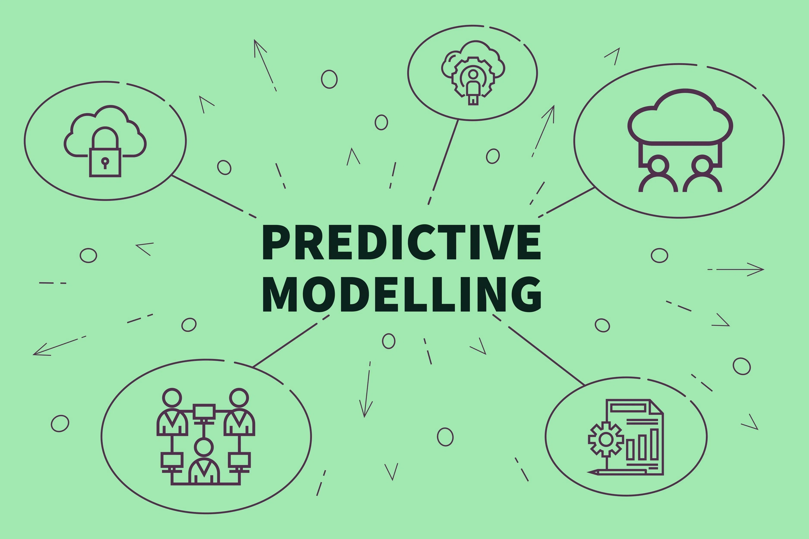

# Predictive Modelling

I developed linear and logistic regression models to estimate product sales and evaluate road crash survival chances. These predictive insights informed proactive decision-making.

- Forecasted firm sales with linear regression (R² 0.93 training, 0.89 testing).
- Predicted car crash survival using logistic regression with 98% accuracy.
- Employment, capital, patents and safety features were key predictors.
